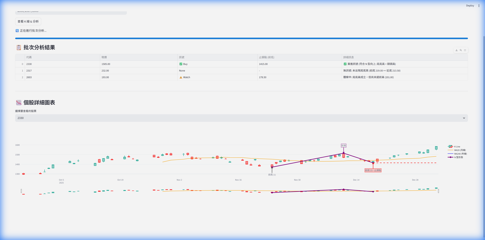

# Taiwan Stock Viewer Walkthrough

The Taiwan Stock Viewer application has been successfully implemented and verified.

## Changes Made
- Created `requirements.txt` with necessary dependencies.
- Created `app.py` as the main Streamlit application.
- Implemented fetching logic using `yfinance` for `.TW` stocks.
- Implemented interactive K-line charts using `plotly` for Daily, Monthly, and Yearly timeframes.
- **New Signal Feature**: Added N-pattern detection (Higher Highs, Higher Lows) to suggest Buy signals and Stop-Loss prices.
- **Batch Analysis**: Added support for analyzing multiple stocks at once with a summary table.

## Verification Results
The application was verified by running locally.

### Screenshots
**Batch Analysis Results:**


**Full Usage Demo:**


## How to Run
To run the application yourself, execute the following command in your terminal:
```powershell
pip install -r requirements.txt
streamlit run app.py
```
Then open the displayed local URL (usually `http://localhost:8501`) in your browser.
